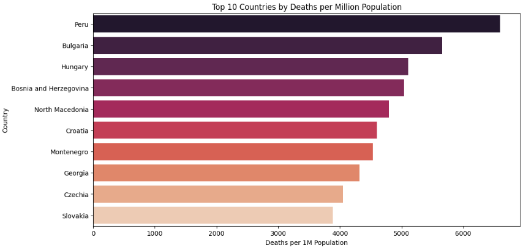
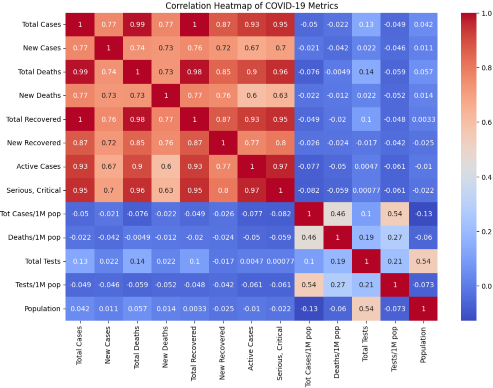

# COVID-19 Global Data Analysis & Visualization 🦠📊

A data science project performing exploratory data analysis (EDA), data cleaning, and insightful visualizations on global COVID-19 statistics using Python (Pandas, Matplotlib, Seaborn).

## 🔍 Key Features

- Cleaned and converted messy real-world COVID-19 dataset into usable format
- Visualized:
  - Top 10 countries by deaths per million population
  - Active vs. Recovered Cases for top countries
  - Total Tests vs. Total Cases (scatter)
  - Trendlines using Line Graphs
- Handled missing values, type conversions, and visual storytelling
- Added correlation matrix and heatmap for deeper insights

## 📁 Dataset

Dataset from [Kaggle](https://www.kaggle.com/) (name: "COVID-19 Global Statistics") — cleaned version used in `covid19_analysis.ipynb`.

## 📊 Libraries Used

- `Pandas`
- `Matplotlib`
- `Seaborn`
- `NumPy`

## 📷 Visuals

Include charts like:
- 
- 

## 💡 Future Ideas

- Add clustering using K-Means to segment countries
- Build an interactive dashboard with Streamlit or Dash
- Time-series prediction using ARIMA or LSTM

## 📜 License

This project is open-source under the MIT License.
